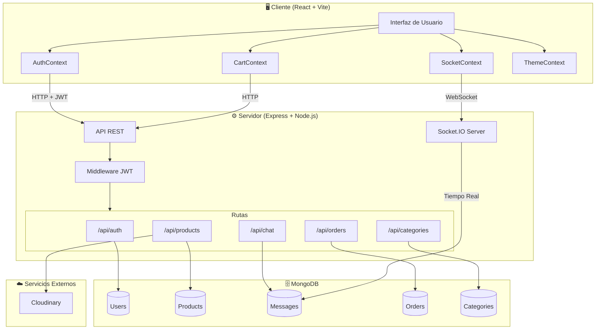

# 🎨 Creative Hands

## 📋 Descripción

Portal de **productos artesanales** con sistema completo de autenticación, roles de usuario, gestión de productos y **chat en tiempo real**. La aplicación permite a usuarios navegar y comprar productos mientras mantienen comunicación directa con el administrador mediante un sistema de mensajería instantánea.

---

## 🔧 Arquitectura del Sistema

---

## ✨ Funcionalidades Principales

### 👤 Para Usuarios

- **Catálogo de productos** con filtros por categoría y búsqueda
- **Carrito de compra** persistente con gestión de cantidades
- **Sistema de pedidos** con seguimiento de estado
- **Reseñas y valoraciones** en productos
- **Chat directo** con el administrador en tiempo real
- **Perfil personal** con historial de pedidos

### 🔧 Para Administradores

- **CRUD completo de productos** con subida de imágenes a Cloudinary
- **Gestión de categorías** para organizar el catálogo
- **Panel de pedidos** con actualización de estados
- **Chat centralizado** para atender a todos los usuarios
- **Visión de usuarios online** en tiempo real

---

## 🔐 Sistema de Autenticación

### Flujo JWT

1. **Registro/Login** → El servidor genera un JWT firmado
2. **Peticiones** → Token enviado en header `Authorization: Bearer <token>`
3. **Validación** → Middleware verifica token en cada ruta protegida
4. **Socket.IO** → Token también autentica conexiones WebSocket

### Roles y Permisos

| Funcionalidad           | Usuario | Administrador |
| ----------------------- | :-----: | :-----------: |
| Ver productos           |   ✅    |      ✅       |
| Comprar productos       |   ✅    |      ❌       |
| Chat con admin          |   ✅    |      ✅       |
| Gestionar productos     |   ❌    |      ✅       |
| Ver todos los pedidos   |   ❌    |      ✅       |
| Panel de administración |   ❌    |      ✅       |

### Seguridad

- Contraseñas hasheadas con **bcrypt**
- **Rate limiting** en endpoints de autenticación (5 intentos / 15 min)
- Validación de inputs con **Joi**
- CORS configurado por entorno

---

## 💬 Chat en Tiempo Real

El sistema de chat implementa comunicación bidireccional usando **Socket.IO**:

- **Mensajería instantánea** entre usuarios y administrador
- **Indicador de escritura** ("usuario escribiendo...")
- **Estado de conexión** (online/offline)
- **Persistencia de mensajes** en MongoDB
- **Notificaciones** de nuevos mensajes
- **Soporte multi-pestaña** por usuario

### Eventos Socket.IO

| Evento              | Dirección           | Descripción                |
| ------------------- | ------------------- | -------------------------- |
| `message:send`      | Cliente → Servidor  | Enviar nuevo mensaje       |
| `message:new`       | Servidor → Cliente  | Notificar mensaje recibido |
| `typing:start/stop` | Bidireccional       | Indicador de escritura     |
| `user:status`       | Servidor → Clientes | Cambio de estado online    |
| `messages:read`     | Bidireccional       | Marcar como leído          |

---

## 📡 API REST

### Autenticación (`/api/auth`)

| Método | Endpoint    | Descripción       | Acceso  |
| ------ | ----------- | ----------------- | ------- |
| POST   | `/register` | Registrar usuario | Público |
| POST   | `/login`    | Iniciar sesión    | Público |
| GET    | `/me`       | Obtener perfil    | Privado |
| PATCH  | `/me`       | Actualizar perfil | Privado |
| POST   | `/logout`   | Cerrar sesión     | Privado |

### Productos (`/api/products`)

| Método | Endpoint            | Descripción         | Acceso  |
| ------ | ------------------- | ------------------- | ------- |
| GET    | `/`                 | Listar productos    | Público |
| GET    | `/:id`              | Obtener producto    | Público |
| POST   | `/`                 | Crear producto      | Admin   |
| PUT    | `/:id`              | Actualizar producto | Admin   |
| DELETE | `/:id`              | Eliminar producto   | Admin   |
| POST   | `/:id/reviews`      | Añadir reseña       | Privado |
| PUT    | `/:id/reviews/:rid` | Editar reseña       | Privado |
| DELETE | `/:id/reviews/:rid` | Eliminar reseña     | Privado |

### Pedidos (`/api/orders`)

| Método | Endpoint       | Descripción       | Acceso  |
| ------ | -------------- | ----------------- | ------- |
| POST   | `/`            | Crear pedido      | Usuario |
| GET    | `/myorders`    | Mis pedidos       | Usuario |
| GET    | `/:id`         | Obtener pedido    | Privado |
| GET    | `/`            | Todos los pedidos | Admin   |
| PUT    | `/:id/deliver` | Marcar entregado  | Admin   |

### Categorías (`/api/categories`)

| Método | Endpoint | Descripción          | Acceso  |
| ------ | -------- | -------------------- | ------- |
| GET    | `/`      | Listar categorías    | Público |
| POST   | `/`      | Crear categoría      | Admin   |
| PUT    | `/:id`   | Actualizar categoría | Admin   |
| DELETE | `/:id`   | Eliminar categoría   | Admin   |

---

**Álvaro Lostal**

---

⭐ **¿Te gusta este proyecto?** ¡Dale una estrella para apoyar mi trabajo!

